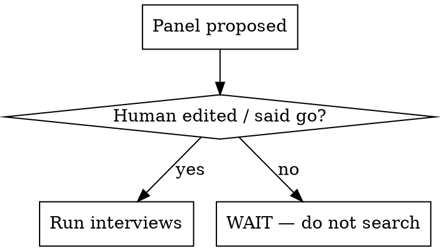

# STORM Research

## Overview

Adapted from Stanford's STORM (NAACL 2024). One-shot research collapses every angle into a smooth average that "argues nothing — retrieval wearing a lab coat." STORM researches like a **panel**: many perspectives, each grounded in named sources, with the disagreements left in. The disagreement is where the insight hides.

**Core principle:** Many angles → grounded interviews with follow-ups → synthesis that leaves the conflicts in → red-team your own brief. The single highest-value move is the human editing the panel *before any search runs* — that edit is judgment entering the loop.

## When to Use

- Vendor / competitor / tool evaluation ("does X really do what they claim?")
- Build-vs-buy, framework choice, architecture trade-offs
- Due diligence on a company, founder claim, or market
- Any question where a balanced summary would be useless and you need a *view*

**Not for:** single fact lookups, "what is the syntax for X", anything one search answers.

## The Method

### Step 1 — Discover the panel, then STOP

Propose six expert perspectives a panel would bring (default: practitioner, skeptic, economist, historian, end user, regulator — swap freely for the topic). For each, write the *single* question that perspective cares about most.

> "Before researching [TOPIC], list six distinct expert perspectives a panel would bring: practitioner, skeptic, economist, historian, end user, regulator. For each, write the single question that perspective cares about most."

**MANDATORY CHECKPOINT — do not search yet.** Present the panel to the human and wait. They cut a perspective, add the one it missed, reword a question. Only after they edit (or explicitly say "go") does any search run.

The pull to skip this and "just research it" is the exact failure the skill prevents. Searching before the edit forfeits the only step that carries judgment.

### Step 2 — Interview each perspective, grounded

> "Take perspective #X. Ask the three sharpest questions it would raise about [TOPIC]. Search the web to answer each, then ask one follow-up per answer and resolve it. Cite every claim. Flag where sources disagree."

For heavy coverage, run this through the `deep-research` Workflow (parallel search + adversarial verification) — *engine for the miles, method to steer.* For lighter topics, run the interviews inline with WebSearch/WebFetch.

### Step 3 — Synthesize with a view

> "From all the interviews, build a non-redundant outline for a smart reader who knows nothing. Write it up with [n] citations. Mark any claim that rests on a single source."

### Step 4 — Red-team your own brief (the step STORM lacks)

STORM won't tell you which of its claims is weakest. So you do it explicitly: name the **single weakest claim**, list every single-source claim, rank sources by reliability, and state **what would flip the conclusion**.

## Output Contract

The brief IS, in this order:

1. **Verdict** — one specific recommended action up front (not "it depends").
2. **The spine** — the central disagreement between perspectives, stated plainly.
3. **Per-perspective findings** — each claim cited; conflicts kept, not averaged away.
4. **Reliability + weakest-claim** — single-source claims marked; the weakest claim named; what would change the answer.

A brief that ends on a balanced both-sides summary has failed. Land on a view.

## Compounding

A brief worth keeping → run `/wiki-file` (durable knowledge) or append confirmed facts to the relevant `expertise.yaml`. Research compounds across sessions instead of evaporating.

## Quick Reference — the prompts

| Step | Prompt |
|---|---|
| 1. Panel | "list six distinct expert perspectives… single question each cares about most" → **STOP, human edits** |
| 2. Interview | "Take perspective #X… three sharpest questions… search… one follow-up each… cite… flag disagreement" |
| 3. Synthesize | "non-redundant outline… [n] citations… mark single-source claims" |
| 4. Red-team | "name the weakest claim, list single-source claims, rank reliability, what would flip this" |

## Common Mistakes

- **Searching before the human edits the panel.** Forfeits the highest-value step. STOP at Step 1.
- **Averaging the disagreement away.** The conflict is the product, not a defect to smooth.
- **No verdict.** "Both have merits" is the failure mode this skill exists to kill.
- **Skipping the red-team.** Unflagged single-source claims are how a confident brief misleads.
- **Picking the wrong panel for the topic.** Generic six ≠ right six. Tailor, then let the human cut/add.
