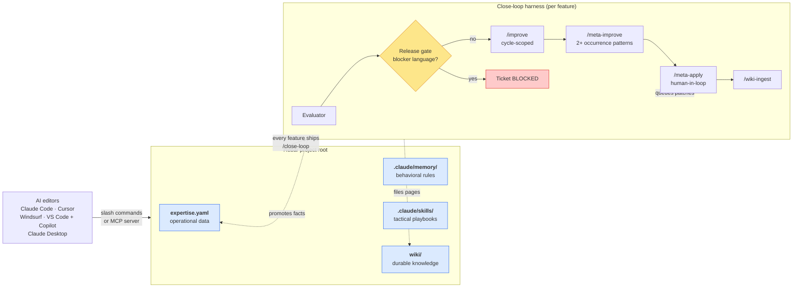

# Rebar

[](LICENSE)
[](.claude/commands/)
[](.claude/skills/)
[](https://github.com/spotcircuit/rebar-mcp)
[](https://getrebar.dev)
[](https://spotcircuit.github.io/rebar-wiki-site/)

**Structural memory for Claude Code (and any MCP-compatible editor).**

Claude Code forgets everything between sessions. Rebar fixes that. 29 slash commands, 6 tactical skills, and a close-loop harness that captures, validates, and compounds project knowledge across sessions. You explain your project once. Every session after that starts with full context.

**[Landing page](https://getrebar.dev)** · **[Public Wiki](https://spotcircuit.github.io/rebar-wiki-site/)** · [Getting Started](wiki/getting-started.md) · [All Commands](wiki/how-it-works/commands.md) · [Architecture + Diagrams](https://spotcircuit.github.io/rebar-wiki-site/diagrams/architecture)

## How it hangs together



Three loops compound over time:
- **Per-observation:** `/improve` validates each observation against live code, promotes confirmed facts into `expertise.yaml`.
- **Per-feature:** `/close-loop` runs the four-gate harness above. The release gate stops "PASS with follow-ups" from being treated like "shipped."
- **Cross-cycle:** `/meta-improve` finds recurring failure patterns (2+ occurrences) and queues template patches for human approval via `/meta-apply`. Subtraction over addition — shorter templates, sharper behavior.

Every cycle: richer context + leaner workflow. Token cost per run goes DOWN as the system learns.

**Deeper diagrams:** [architecture.md](wiki/diagrams/architecture.md) has 6 mermaid diagrams covering overall architecture, the close-loop harness in detail, the four knowledge systems, command workflow, and agent orchestration. [command-flow.md](wiki/diagrams/command-flow.md) has 5 more showing client onboarding, development cycle, knowledge capture, feature workflow, and agent coordination.

## The Problem

```
Session 1: "Here's our architecture, we use FastAPI, the deploy goes to..."
Session 2: "Remember yesterday? We use FastAPI, the deploy goes to..."
Session 3: "So like I was saying, FastAPI, and the deploy..."
```

Every Claude Code session starts from zero. Project context lives in your head. Tribal knowledge stays tribal.

## How Rebar Fixes It

```bash
npx create-rebar my-project
cd my-project

# In Claude Code:
/create my-client         # Set up a project
/discover my-client       # Auto-generate expertise.yaml from your codebase
```

Or clone the full repo with examples:
```bash
git clone https://github.com/spotcircuit/rebar.git
```

That's it. Now every session starts by reading `expertise.yaml` -- your project's structured memory.

As you work, commands capture what you learn:
```
/improve my-project       # Validate observations against live code
                          # Promotes confirmed facts, discards stale ones
                          # Your context compounds over time
```

**Not using Claude Code?** Rebar ships an MCP server (`@spotcircuit/rebar-mcp`) that exposes the same expertise, wiki, skills, and close-loop state to Cursor, Windsurf, VS Code Copilot, and Claude Desktop. [See the "Works with ANY AI Editor" section below.](#works-with-any-ai-editor)

[Full getting started guide ->](wiki/getting-started.md)

## What You Get

**Not a CLI tool, SDK, or plugin.** These are markdown files in `.claude/commands/` that Claude Code reads as instructions. Clone the repo and the commands just work.

### Context that persists

| What happens | Without Rebar | With Rebar |
|---|---|---|
| Session 1 | Explain everything | `/discover` captures it |
| Session 2 | Explain it again | Claude reads expertise.yaml |
| Session 3 | Explain it again | Claude already knows |
| After a bug fix | You remember, AI doesn't | `/improve` captures the gotcha |
| New team member | 2 weeks onboarding | `/brief` gives full context |

### 29 commands across five categories

**Project context** — `/create`, `/discover`, `/brief`, `/prime`, `/check`, `/improve`, `/meeting`
Scaffold a client, auto-generate expertise from the codebase, produce a standup brief, prime an agent on a client's external codebase (reads `clients/<name>/prime.md`), validate compliance, promote validated observations, ingest meeting notes.

**Development** — `/new`, `/feature`, `/bug`, `/takeover`, `/plan`, `/build`, `/test`, `/review`
The day-to-day build loop — scaffold new apps, add features, fix bugs, take over inherited code, plan implementations, execute plans, run tests, review diffs.

**Knowledge** — `/wiki-ingest`, `/wiki-file`, `/wiki-lint`
Process `raw/` files into wiki pages, file a conversation insight as a permanent page, health-check orphans + broken links + stale pages.

**Self-learning harness** — `/close-loop`, `/meta-improve`, `/meta-apply`, `/harness-decay-audit`
The compounding mechanism. After every shipped feature, `/close-loop` runs a 4-gate cycle: an evaluator validates the diff, a release gate blocks on deploy-blocker language (`"must generate migration"`, `"cannot ship"`, `"before any live DB"`), `/improve` promotes that cycle's observations into `expertise.yaml`, `/meta-improve` scans across cycles for 2+ occurrence patterns and **queues patches against your slash commands and skills** (the templates themselves), and `/meta-apply` lets you review each patch before it lands. **`/harness-decay-audit`** runs quarterly (or after any model upgrade) — inventories every slash command, skill, and agent, scores each on signals like recent invocation and command class, and proposes kill-switch tests on the suspects. This is how the system optimizes its own workflow over time — shorter templates, sharper behavior, fewer tokens per run. Subtraction over addition: if a rule fails twice, add it; if agents succeed without it, prune it.

**Advanced** — `/plan-build-improve`, `/test-learn`, `/plan-scout`, `/build-parallel`, `/scout`, `/meta-prompt`
Compound flows — plan + build + improve in one pass, test-driven learning, parallel execution across multiple agents, scout-before-plan for large codebases, meta-prompting.

Plus six tactical **skills** under `.claude/skills/` (content-strategy, content-production, content-humanizer, ai-seo, copywriting, launch-strategy) from [alirezarezvani/claude-skills](https://github.com/alirezarezvani/claude-skills). Claude Code auto-discovers them by keyword. `/meta-improve` can queue patches against these too — skills are first-class optimization targets alongside slash commands.

[See all commands with examples ->](wiki/how-it-works/commands.md)

### Use cases

**Inherited a legacy codebase?** -- `/takeover` scans the architecture, builds expertise.yaml, and documents everything it finds. One session to understand 200K lines.

**Freelancer juggling clients?** -- Each client gets their own `clients/{name}/` directory. `/brief` before switching gives you full context in 10 seconds.

**Open source maintainer with 5+ repos?** -- Each repo gets its own expertise.yaml. `/discover` once, context forever.

**Post-incident knowledge capture?** -- Drop the Slack #incidents export in `raw/`, run `/wiki-ingest`, get structured wiki pages with root cause analysis.

**Context compaction killing your long sessions?** -- `/improve` before compaction persists everything to expertise.yaml. Your observations survive the context wipe.

### Four layers of knowledge

| File | What it holds | How it updates |
|---|---|---|
| `expertise.yaml` | Project state, API gotchas, architecture decisions | Commands append, `/improve` validates |
| `.claude/memory/` | Your preferences, guardrails, behavioral rules | Claude updates automatically |
| `.claude/skills/` | Tactical playbooks (content-humanizer, ai-seo, etc.) | `scripts/update-skills.sh` pulls upstream |
| `wiki/` | Patterns, decisions, synthesized knowledge | `/wiki-ingest`, `/wiki-file` |

They're separate because they change at different speeds. `expertise.yaml` updates every session. Memory updates when Claude notices a preference. Skills update when you pull from upstream. Wiki updates when durable knowledge emerges.

## Real Examples

### What expertise.yaml looks like after 4 sessions

```yaml
# apps/site-builder/expertise.yaml (real, not generated for this README)
architecture:
  backend: FastAPI + Python 3.13 + asyncio
  frontend: Vue 3 + TypeScript + Pinia
  ai_content: Claude Sonnet
  deploy_primary: Cloudflare Pages

api_gotchas:
  - "Google Maps blocks headless Chrome without stealth plugin"
  - "Claude sometimes returns markdown in HTML fields -- sanitize"
  - "Cloudflare Pages has a 100-project limit -- auto-delete oldest"

key_decisions:
  - "Vue for dashboard, React for generated sites -- different concerns"
  - "WebSocket for progress -- real-time feedback matters for 60s generation"

unvalidated_observations: []  # Clean -- all validated by /improve
```

[See the full expertise.yaml ->](apps/site-builder/expertise.yaml)
[See the build journal showing how it grew ->](apps/site-builder/BUILD_JOURNAL.md)

### What raw file ingestion looks like

Drop a messy meeting transcript in `raw/`:
```
raw/demo-meeting-transcript.md  <- messy Teams transcript
raw/demo-slack-export.md        <- #incidents channel dump
raw/demo-jira-notes.md          <- sprint tickets
```

Run `/wiki-ingest`. Get structured wiki pages with cross-references.

[See the raw files ->](raw/) | [See what came out ->](wiki/examples/demo-corp.md)

## How is this different from X?

**"How is this different from claude-mem?"** -- claude-mem is a tape recorder. It captures raw session transcripts and replays them. Rebar is a learning system. It captures observations, validates them against live code, promotes confirmed facts into structured knowledge, and uses that knowledge to power 23 specialized workflows. claude-mem remembers what happened. Rebar understands your project. They can coexist.

**"Just use a good README"** -- READMEs are static. Rebar's expertise.yaml updates as you work. `/improve` validates observations against actual code so the context stays accurate.

**"Just use Obsidian"** -- Obsidian is manual curation. Rebar captures knowledge during development and validates it programmatically. The wiki/ folder IS an Obsidian vault if you want it.

**"Confluence / Notion"** -- Those are for humans to maintain. Rebar's files are designed to be read and written by an LLM during work. They live in your repo, not a separate tool.

**"I'll just use CLAUDE.md"** -- CLAUDE.md is one file. Rebar adds structured per-project expertise, a self-learning close-loop harness, 29 commands, tactical skills, and a wiki. CLAUDE.md is part of the system, not the whole system.

**"Context compaction keeps wiping my session"** -- Run `/improve` before long sessions. It persists observations to expertise.yaml before compaction can erase them. Rebar is the compaction survival strategy.

## Works with ANY AI Editor

Rebar is framework-first, not editor-locked. The `@spotcircuit/rebar-mcp` MCP server exposes all of rebar's state — expertise files, wiki pages, observations, skills, and close-loop harness state — to any MCP-compatible tool: **Cursor, Windsurf, VS Code + GitHub Copilot, Claude Desktop, Zed, Continue.dev**, and any other editor that speaks MCP.

```bash
npx @spotcircuit/rebar-mcp
```

Add to your editor's MCP config:
```json
{
  "mcpServers": {
    "rebar": {
      "command": "npx",
      "args": ["@spotcircuit/rebar-mcp"]
    }
  }
}
```

**17 MCP tools exposed:**

| Tool | What it does |
|---|---|
| `rebar_list_projects` | Enumerate apps + clients + tools with basic info |
| `rebar_observe` | Append an observation to `unvalidated_observations` |
| `rebar_validate` | Classify an observation as promote / discard / defer |
| `rebar_search` | Full-text search across all expertise files + wiki |
| `rebar_diff` | Show what changed in `expertise.yaml` since last session |
| `rebar_promote` / `rebar_discard` | Act on observations |
| `rebar_ingest` | List files in `raw/` ready for wiki ingestion |
| `rebar_stats` | Dashboard overview — projects, observations, wiki pages, last updated |
| `rebar_config` | Generate exact JSON config for any AI editor (auto-detects REBAR_ROOT) |
| **`rebar_skills`** | List `.claude/skills/` + which agent invokes each (new 2029-04-17) |
| **`rebar_harness`** | Close-loop state — pending meta-improve patches, evaluator log, run history (new 2029-04-17) |
| `rebar_install_hooks` / `rebar_uninstall_hooks` | Git hooks for auto-observe |
| `rebar_session_start` / `rebar_session_end` | Track session boundaries |

Your expertise, wiki, observations, skills, and close-loop state are now first-class in every AI editor — not just Claude Code.

[Setup guide for Cursor, Windsurf, VS Code, Claude Desktop →](https://github.com/spotcircuit/rebar-mcp)

## The self-learning harness

Every feature goes through a 4-gate close-loop cycle before it's marked "done":

1. **Evaluator** validates the diff, scope, and completeness. Writes findings to `raw/eval-*.md` + `system/evaluator-log.md`.
2. **Release gate** scans the eval for blocker language ("must generate migration," "cannot deploy," "before any live DB"). If any hit, the ticket is `blocked` — not `done`.
3. **`/improve --from raw/eval-*.md`** promotes only THIS cycle's observations into `expertise.yaml`. Older backlog untouched.
4. **`/meta-improve`** finds patterns across 2+ cycles and writes template patches to `system/meta-improve-queue/` for operator approval via **`/meta-apply`**.

Every cycle makes the next one cheaper AND better: context gets richer, workflow gets leaner. Total tokens per run go DOWN as the system learns.

[Harness deep-dive →](blog/published/harness-less-is-more.md)

## Optional: Agent Orchestration

Paperclip agents run on schedules (not required for the core framework):

| Agent | What it does |
|---|---|
| Rebar Steward | Runs `/close-loop` + validates expertise.yaml every 4 hours |
| Evaluator | Evaluates shipped work, writes `raw/eval-*.md` + evaluator-log |
| Wiki Curator | Processes `raw/` intake every 30 minutes |
| GTM Agent | Weekly content + outreach calendar using `launch-strategy` skill |
| Blog Writer | Daily content pipeline using `content-strategy` + `content-production` skills |
| Triage Agent | Routes incoming issues to the right specialist |

```bash
npm install -g paperclipai
export PAPERCLIP_COMPANY_ID=your-id
bash scripts/paperclip-sync.sh agents    # syncs metadata + pushes AGENTS.md preamble
```

Paperclip's AGENTS.md is managed-mode, so `paperclip-sync.sh agents` auto-runs a `preamble` push that self-heals the cwd directive across all agents. Never manually hand-edit AGENTS.md files.

## Directory Structure

```
rebar/
  .claude/commands/           # 29 slash commands (incl. /close-loop, /meta-improve, /meta-apply)
  .claude/skills/             # 6 tactical skills from claude-skills (content-*, ai-seo, copywriting, etc.)
  apps/                       # Your apps (site-builder, prepitch examples included)
  clients/                    # Your clients (demo-corp, acme-integration examples)
  tools/                      # Infrastructure rebar depends on (paperclip, claude-skills)
  wiki/                       # Knowledge wiki (Obsidian-compatible, Quartz-rendered)
  raw/                        # Drop zone for files to ingest
  system/
    agents/                   # Paperclip agent YAMLs + _agents-md-preamble.md (source of truth)
    meta-improve-queue/       # Template patches awaiting /meta-apply review
    evaluator-log.md          # Append-only record of every evaluator run
    meta-improve-log.md       # Append-only record of every meta-improve run
  scripts/
    guard-cwd.sh              # Fail-fast cwd assertion (source from any long-running script)
    update-skills.sh          # Refresh skills from alirezarezvani/claude-skills
    paperclip-sync.sh         # Sync agent metadata + self-heal AGENTS.md preamble
    cross-post.sh             # Blog → site + Medium + Substack + LinkedIn + Facebook
    wsl-ip.sh                 # Print WSL eth0 + Windows gateway (for cross-boundary work)
```

## Inspiration

The wiki pattern is based on [Andrej Karpathy's LLM Wiki](https://karpathy.ai/) concept -- using structured markdown as a knowledge layer that LLMs read natively. Rebar extends it with structured YAML for operational data, a validation loop, and a full development command suite.

The agentic-coding framing -- skill engineering over prompt engineering, specialized agents with explicit contracts, and the case for treating the slash-command harness as the real unit of leverage -- comes from [Dan Tennant / IndyDevDan](https://github.com/disler) ([YouTube](https://www.youtube.com/@indydevdan)). Work in this repo leans heavily on his [agentic-prompt-engineering](https://github.com/disler/agentic-prompt-engineering), [building-specialized-agents](https://github.com/disler/building-specialized-agents), and [elite-context-engineering](https://github.com/disler/elite-context-engineering) repos. The close-loop harness here is a direct descendant of the "observe → pattern → prune, don't just add" discipline he's been making the case for.

The tactical marketing skills live in `.claude/skills/` and come from [Alireza Rezvani's claude-skills](https://github.com/alirezarezvani/claude-skills) (11.3K stars, MIT) -- refresh with `bash scripts/update-skills.sh`.

## Prerequisites

- [Claude Code](https://claude.ai/code) CLI
- Python 3.10+ (for YAML validation)
- Node.js 18+ (only for Paperclip agents, optional)

## License

MIT -- see [LICENSE](LICENSE).

Built by [Brian Pyatt / SpotCircuit](https://spotcircuit.com) | [getrebar.dev](https://getrebar.dev)
