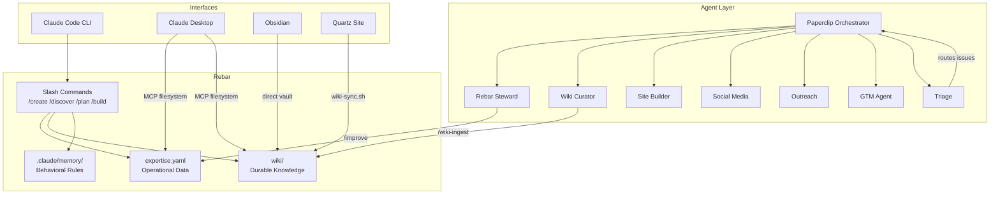
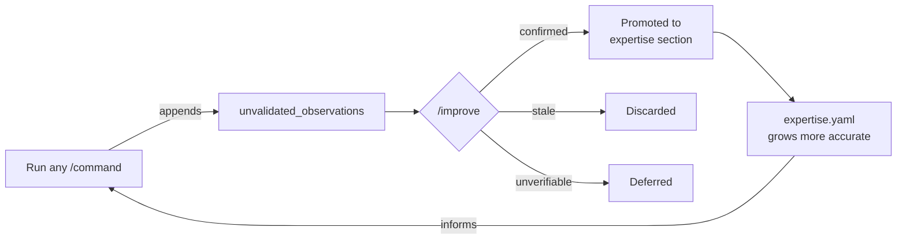
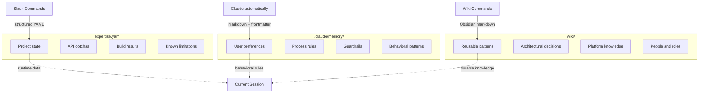
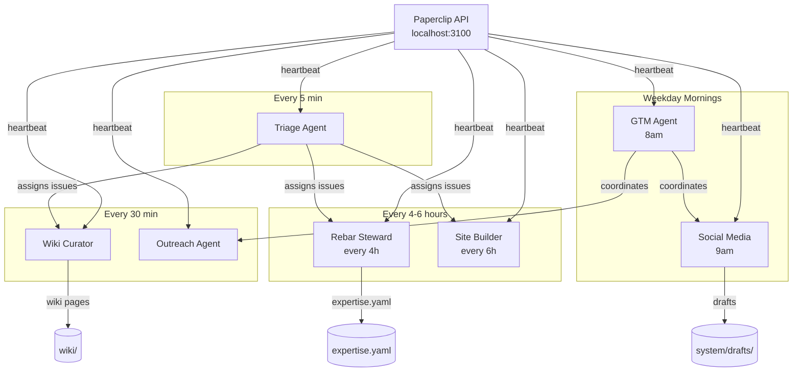

# Architecture Diagrams

Visual overview of how the Rebar components connect.

## Overall Architecture



## Self-Learn Loop



Every slash command appends raw observations. The `/improve` command validates each one against current state and either promotes it into the relevant section, discards it, or defers it for later verification.

## Three Knowledge Systems



Each system serves a different purpose. They stay separate by design:
- **expertise.yaml** -- operational data that changes frequently (updated by `slash commands` commands)
- **.claude/memory/** -- behavioral rules and preferences (updated by Claude automatically)
- **wiki/** -- synthesized knowledge that compounds over time (updated by `/wiki-*` commands)

## Command Workflow

```mermaid
graph LR
    CREATE[/create] --> DISCOVER[/discover]
    DISCOVER --> CHECK[/check]
    CHECK --> BRIEF[/brief]
    BRIEF --> PLAN[/plan]
    PLAN --> BUILD[/build]
    BUILD --> TEST[/test]
    TEST --> REVIEW[/review]
    REVIEW --> IMPROVE[/improve]
    IMPROVE -->|next session| BRIEF
```

A typical engagement flows from left to right. Each session starts with `/brief` and ends with `/improve`. The cycle repeats, and expertise.yaml gets more accurate with each pass.

## Agent Orchestration



Paperclip triggers each agent on its cron schedule. The Triage Agent runs most frequently (every 5 minutes) to route new issues. The GTM Agent runs at 8am to set the day's strategy before the Social Media Agent posts at 9am.

## Related

- [Command Flow](command-flow.md) -- detailed command chaining diagrams
- [Paperclip](../tools/paperclip.md) -- agent setup and management
- [Three Knowledge Systems](../how-it-works/three-systems.md) -- detailed explanation
