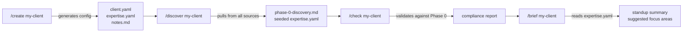
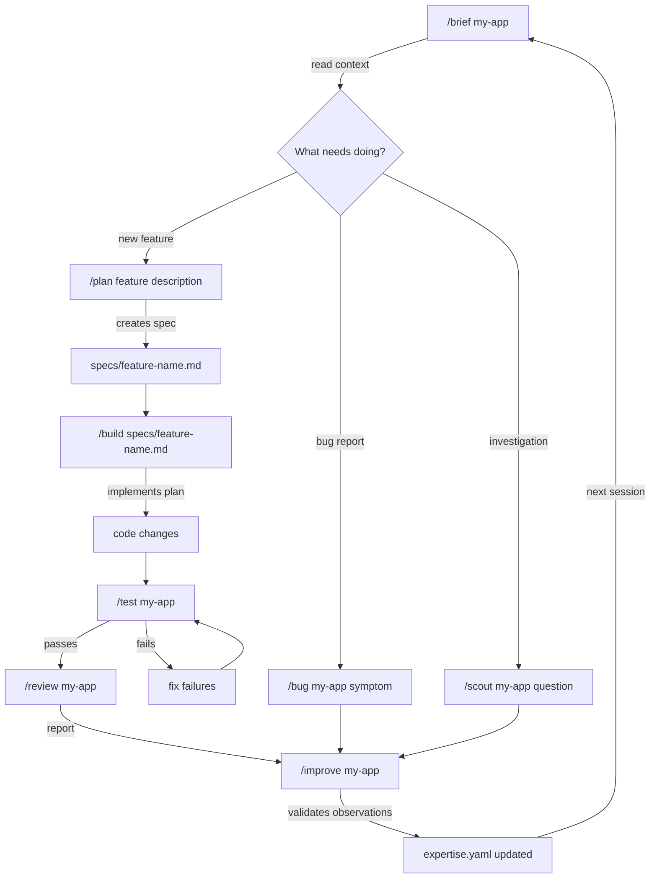
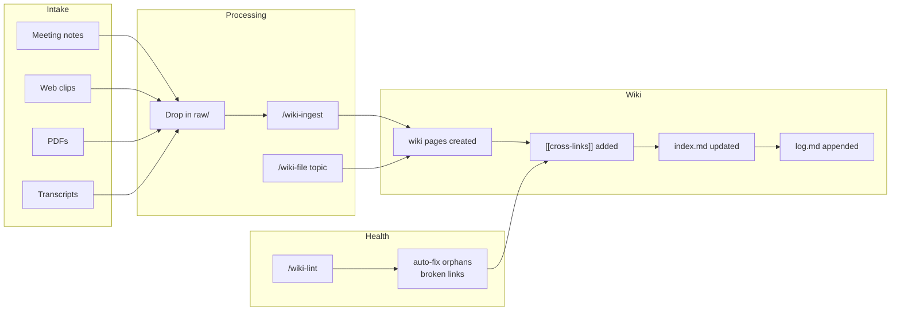
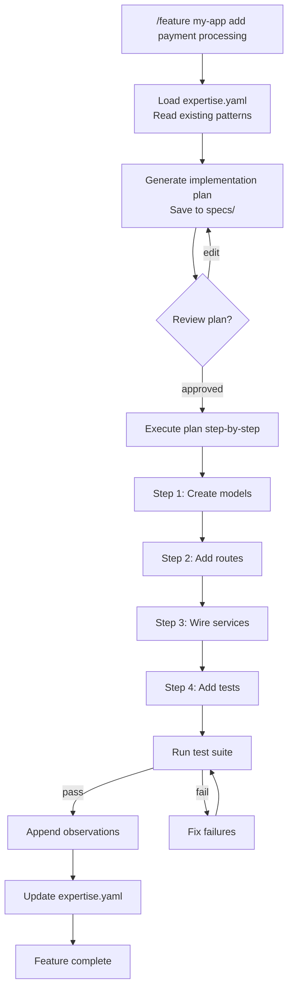
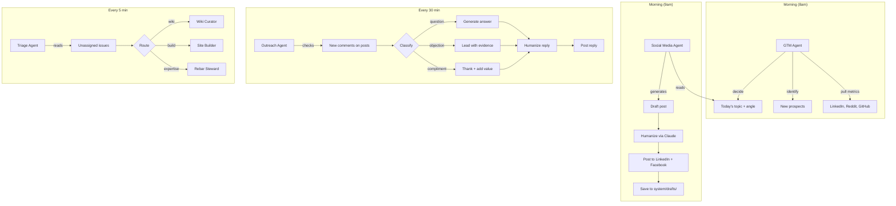

# Command Flow Diagrams

Visual flows showing how Rebar commands chain together in practice.

## Client Onboarding

Start with `/create` to scaffold the client directory. `/discover` fills it with everything the framework can find. `/check` validates completeness. `/brief` gives you a starting point for the first session.

## Development Cycle

Every session starts with `/brief` and ends with `/improve`. The loop tightens expertise.yaml with each pass. Bug fixes and investigations also feed the self-learn loop.

## Knowledge Capture

Two paths into the wiki: drop files in `raw/` and run `/wiki-ingest`, or capture conversation insights with `/wiki-file`. Both produce linked, indexed wiki pages. `/wiki-lint` keeps everything connected.

## Feature Workflow (Detailed)

The `/feature` command combines `/plan` and `/build` into a single workflow. It loads project context first, so the plan reflects existing patterns and known limitations.

## Agent Coordination Flow

The GTM Agent sets the day's strategy. The Social Media Agent executes it. The Outreach Agent handles engagement. The Triage Agent routes everything else.

## Related

- [Architecture](architecture.md) -- system-level diagrams
- [Commands](../how-it-works/commands.md) -- full command reference
- [Paperclip](../tools/paperclip.md) -- agent setup
